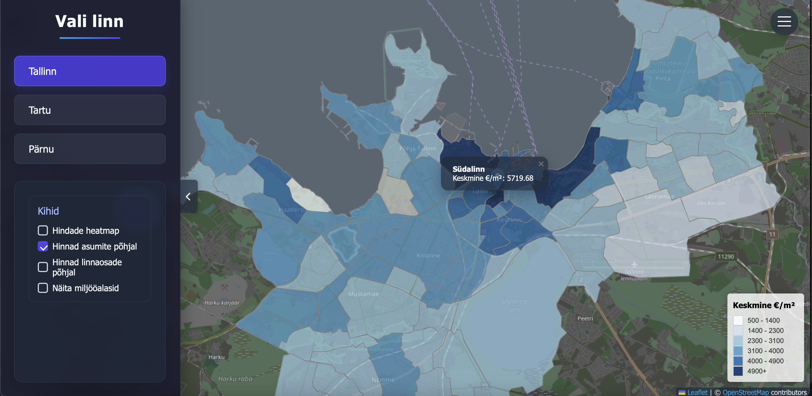

# Kinnisvara kaardirakendus & hindade ennustusmudel
**Tallinn | Tartu | Pärnu**

- [Projekti ülesehitus](#projekti-ülesehitus)  
- [Andmed](#andmed)
- [Projekti kulg](#projekti-kulg)      
- [Autorid](#autorid)

---

## Projekti ülesehitus

* Frontend streamlit
* Kraapijad
* Catboost
* mermaid diagramm ülesehituse kohta
* Seletada miks ainult need 3 linna
* Link töötavale projektile - streamlit v folium 

---

## Andmed

* Siia jutt kuidas scraperid töötasid, kuidas andmeid puhastasin jne
* võltsandmetega näidised, mõni väike näide kuidas andmed algul olid
* seletada lahti arhitektuuriperioodid - miks nii valisin

---

## Projekti kulg

* Siin räägin millesed probleemid esile kerkisid ja kuidas neid lahendasin - nt postman jne & wayback machine vark

* Esmalt wayback machine
* Analüüs Postmaniga
* Avaandmetest (https://avaandmed.eesti.ee/datasets/tallinna-linnaosade-ja-asumite-kaardifailid) tõmbasin .SHP faili ning tegin selle lihtsuse huvites .geojson failiks - lihtsustab kaardirakenduse tegemist.
* Töötlesin tln_asumid.py abil tooreid andmeid - uus geojson fail kus vaid geometry ja asum/linnaosa
* Katsetan veidi streamlitiga - kas kaardirakenduseks mõistlik jne
* vaja kontrollida kas tartul on endine tähtvere vald või mitte - kui on tuleks ilmselt ära võtta

---
## Kasutatud allikad

https://avaandmed.eesti.ee/datasets/tallinna-linnaosade-ja-asumite-kaardifailid
https://www.arcgis.com/apps/mapviewer/index.html?url=https://services7.arcgis.com/JHeJMqXQ296PjBWU/ArcGIS/rest/services/Keskuslinna_asumite_piirid/FeatureServer&source=sd
https://www.arcgis.com/apps/mapviewer/index.html?url=https://gis.tartulv.ee/arcgis/rest/services/IT/GI_linnaosad/FeatureServer&source=sd

---

## Autorid
* Remo Tsernant – <remo.tsernant.rt@gmail.com>  
* Mihkel Orasmäe - <mihkel.orasmae@gmail.com>
